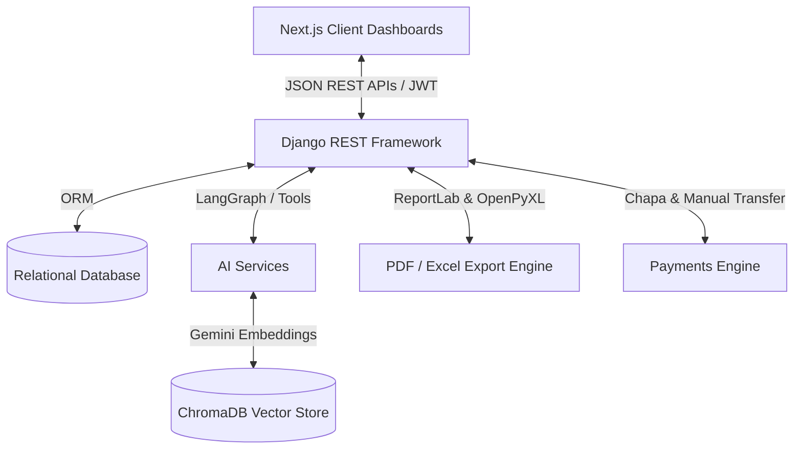

# ⚖️ JusticeHub — Project Defense & Group Study Guide

Congratulations on completing the **JusticeHub Digital Judiciary Platform**! This guide is systematically organized to help your 5-member team prepare for an outstanding project defense. 

It breaks down the technology stack, allocates distinct roles for each of the 5 group members (with specific emphasis on splitting the frontend roles as requested), explains core codebase flows, and lists anticipated examiner questions with their perfect answers.

---

## 📌 Section 1: System Overview & Tech Stack
JusticeHub is a secure, role-based Digital Judiciary Platform designed to digitize the case lifecycle, automate court bookings, process financial checkouts, log auditable actions, and offer AI-powered legal assistance through **JusticeBot** (a tool-enabled conversational agent).



### 🛠️ Technology Stack
*   **Backend Framework**: Django 6.0+ with **Django REST Framework (DRF)**.
*   **Authentication**: Stateless JSON Web Tokens (**SimpleJWT**) with dynamic Email OTP verification.
*   **AI Orchestration**: **LangGraph** (Stateful ReAct Agent loop), **LangChain**, and **ChromaDB** (local Vector Database for RAG).
*   **AI Foundation Models**: Google **Gemini-3-Flash** (primary) with resilient fallbacks (OpenAI GPT-4o-mini, Groq Llama-3.3, and HuggingFace Mistral).
*   **Reporting Engines**: **ReportLab** (pixel-perfect vector PDF generation) and **OpenPyXL** (dynamic styled spreadsheet generation).
*   **Payment Processing**: Dual-mode engine supporting **Chapa API checkouts** and a manual **Bank Transfer upload + Registrar approval** system.
*   **Frontend Architecture**: **Next.js 15+ (App Router)** utilizing vanilla CSS for customizable premium aesthetics and standard React state management.

---

## 👥 Section 2: 5-Member Team Role Classification
To ensure every member speaks confidently, we have divided the platform into 5 logical domains. We have explicitly structured **two separate frontend specialists**—one focusing on the Client/Defendant portals and the other focusing on the Registrar/Admin/Judge panels—while merging backend Security, Compliance, and AI systems under a single powerhouse role.

---

### 👤 Member 1: Backend System Architect & Lead Database Engineer
**Core Focus**: Overall backend system architecture, relational database design, case state transitions, and core cases CRUD APIs.

#### 🎯 Key Responsibilities
1.  Explain how cases move from **FILING** ➡️ **PENDING_REVIEW** ➡️ **APPROVED** ➡️ **ASSIGNED** ➡️ **DECIDED** ➡️ **CLOSED**.
2.  Detail the database entity relationships (User, Case, Hearing, Decision, CaseActionRequest, AuditLog).
3.  Discuss bulk operation performance optimization (e.g., bulk judge assignment, bulk status updates).

#### 📂 Codebase Files to Study
*   [`backend/cases/models.py`](file:///c:/Users/HP/justicehub/backend/cases/models.py): Learn case fields, file number generation, and relationships.
*   [`backend/cases/views.py`](file:///c:/Users/HP/justicehub/backend/cases/views.py): Learn views and actions for assigning judges, notes, and timelines.
*   [`backend/config/urls.py`](file:///c:/Users/HP/justicehub/backend/config/urls.py): Master the global routing structure.

---

### 👤 Member 2: Frontend UX Engineer A (Citizen/Plaintiff & Defendant Portals)
**Core Focus**: User interfaces and interaction flows for public-facing users: the **Citizen/Plaintiff dashboard**, **Defendant portal**, signup/login screens, and chatbot widget integration.

#### 🎯 Key Responsibilities
1.  Explain how Citizens (Plaintiffs) sign up, verify their email with OTP, submit **New Cases**, upload evidence PDFs, and view active notifications.
2.  Detail the **Defendant dashboard**: how defendants log in using temporary admin-generated credentials, set their permanent password, view pending cases, and retrieve case files.
3.  Discuss the checkout integration: triggering payments via Chapa checkout redirects or uploading bank transfer verification receipts.

#### 📂 Codebase Files to Study (Frontend Pages & Views)
*   **Public Portal & Landing Chat**:
    *   [`frontend/app/page.js`](file:///c:/Users/HP/justicehub/frontend/app/page.js): The landing page featuring system summaries and the public unauthenticated chatbot panel.
*   **Authentication & Registration Flow**:
    *   [`frontend/app/signup/page.jsx`](file:///c:/Users/HP/justicehub/frontend/app/signup/page.jsx): Citizen self-signup registration form.
    *   [`frontend/app/login/page.jsx`](file:///c:/Users/HP/justicehub/frontend/app/login/page.jsx): JWT credentials credentials form.
    *   [`frontend/app/verify-otp/page.jsx`](file:///c:/Users/HP/justicehub/frontend/app/verify-otp/page.jsx): OTP 6-digit confirmation code verification screen with timer limits.
    *   [`frontend/app/setup-account/page.jsx`](file:///c:/Users/HP/justicehub/frontend/app/setup-account/page.jsx): Set-password screen for admin-generated users (e.g. Defendants).
*   **Citizen / Plaintiff Dashboards**:
    *   [`frontend/app/dashboard/client/layout.jsx`](file:///c:/Users/HP/justicehub/frontend/app/dashboard/client/layout.jsx): Navigation layout specifically for Citizens.
    *   [`frontend/app/dashboard/client/page.jsx`](file:///c:/Users/HP/justicehub/frontend/app/dashboard/client/page.jsx): Index dashboard with stat panels (Active Cases, Scheduled Hearings, Invoices) and **JusticeBot** authenticated chat panel.
    *   [`frontend/app/dashboard/client/register-case/page.jsx`](file:///c:/Users/HP/justicehub/frontend/app/dashboard/client/register-case/page.jsx): Interactive case registration wizard with file upload handlers.
    *   [`frontend/app/dashboard/client/cases/page.jsx`](file:///c:/Users/HP/justicehub/frontend/app/dashboard/client/cases/page.jsx): List and display modal details for active filings.
    *   [`frontend/app/dashboard/client/documents/page.jsx`](file:///c:/Users/HP/justicehub/frontend/app/dashboard/client/documents/page.jsx): Vault list showing evidence files, and version control options.
    *   [`frontend/app/dashboard/client/schedule/page.jsx`](file:///c:/Users/HP/justicehub/frontend/app/dashboard/client/schedule/page.jsx): Hearing catalog list and join links.
    *   [`frontend/app/dashboard/client/payment-success/page.jsx`](file:///c:/Users/HP/justicehub/frontend/app/dashboard/client/payment-success/page.jsx): Success post-back redirect landing page.
*   **Defendant Dashboards**:
    *   [`frontend/app/dashboard/defendant/layout.jsx`](file:///c:/Users/HP/justicehub/frontend/app/dashboard/defendant/layout.jsx): Navigation sidebar structure for Defendants.
    *   [`frontend/app/dashboard/defendant/page.jsx`](file:///c:/Users/HP/justicehub/frontend/app/dashboard/defendant/page.jsx): Main panel listing court summonses and quick-access files.
    *   [`frontend/app/dashboard/defendant/cases/page.jsx`](file:///c:/Users/HP/justicehub/frontend/app/dashboard/defendant/cases/page.jsx): List of court case descriptions where they are assigned as Defendant.
    *   [`frontend/app/dashboard/defendant/documents/page.jsx`](file:///c:/Users/HP/justicehub/frontend/app/dashboard/defendant/documents/page.jsx): Portal for downloading court summonses and uploading defense briefs/claims.

#### 🔌 Backend API Endpoints Interacted With
*   `/api/auth/citizen-register/` (User self-signup data POST)
*   `/api/auth/login/` (JWT token retrieval)
*   `/api/auth/verify-otp/` & `/api/auth/resend-otp/` (Email validation keys)
*   `/api/auth/set-password/` (Password setup payload)
*   `/api/cases/` (Filing and listing active filings)
*   `/api/cases/citizen/documents/` (Filing evidence and viewing case records)
*   `/api/payments/initiate/<case_id>/` & `/api/payments/bank-transfer-submit/` (Financial checkout triggers)
*   `/api/ai/chat/sessions/` & `/api/ai/chat/public/` (JusticeBot conversational context)

#### 🧠 Core Concepts to Master
1.  **Next.js 15 App Router Structure**:
    *   Explain how nested folder structures (e.g., `/dashboard/client/`) automatically configure routes.
    *   Understand the difference between Client components (`"use client"`) which enable hooks and state, vs. Server components.
2.  **Stateless JWT Authentication Integration**:
    *   How user tokens (`access` & `refresh`) and roles are saved in the browser local storage upon a successful login.
    *   How the **Axios Interceptor** flow intercepts backend requests, detects token expiration, automatically posts to `/api/auth/token/refresh/` using the refresh key, updates the access key, and seamlessly retries the blocked API query in the background.
3.  **Multipart Form Data & File Handling**:
    *   Explain how the case registration and evidence portals construct a standard `FormData()` payload in JavaScript to append text fields along with binary files (PDFs/Images).
    *   Explain how file content headers `Content-Type: multipart/form-data` are passed to Django, allowing file uploads to the backend media folder.
4.  **OTP Verification Timer Cycles**:
    *   How React's `useEffect` hook operates local variables with `setInterval` to run a 60-second visual resend-OTP timer, preventing duplicate requests and rate-limiting abuse.
5.  **Chapa API Redirect Integrations**:
    *   Understand how the frontend initiates Chapa checkouts: calling backend `/initiate/` API, retrieving the external payment checkout URL, routing the user there, and capturing parameters back on the `/payment-success/` route.
6.  **JusticeBot Conversational State Lifecycle**:
    *   Understand the state arrays (`messages`, `setMessages`), processing chat streams, scrolling to bottom dynamically upon new assistant messages, and attaching JWT context to authenticated sessions.
7.  **Dynamic UI Rendering & Permissions**:
    *   How conditional JSX blocks elements dynamically (e.g., hiding file upload inputs or graying out payment buttons based on current case progression or user status flags).

#### 🔗 Member 2: Backend API Integration Architecture & Code Mechanics
To ace the defense, Member 2 must be ready to explain the programmatic interface connecting Next.js to the Django REST backend, implemented centrally in [`frontend/lib/api.js`](file:///c:/Users/HP/justicehub/frontend/lib/api.js):

##### 1. Dynamic JWT Authorization Injector
All authenticated client requests rely on `getAuthHeaders()` to extract the token from browser storage and inject it into the request headers:
```javascript
const getAuthHeaders = () => {
    const token = typeof window !== "undefined" ? localStorage.getItem("access_token") : null;
    return {
        "Content-Type": "application/json",
        ...(token ? { "Authorization": `Bearer ${token}` } : {})
    };
};
```

##### 2. Auto-Resilient Request wrapper with Token Refresh
All case and document requests are routed through a fetch wrapper `apiRequest(url, options)`. If the backend returns `401 Unauthorized` due to access token expiration, it halts the request, fetches a new access token via the refresh key, updates storage, and automatically retries the initial request:
```javascript
async function apiRequest(url, options = {}) {
    const authHeaders = getAuthHeaders();
    if (options.body instanceof FormData) {
        delete authHeaders['Content-Type']; // Let the browser set the multipart boundary
    }

    const res = await fetch(url, {
        ...options,
        headers: { ...authHeaders, ...options.headers }
    });

    if (res.status === 401) {
        const newToken = await refreshAccessToken();
        if (newToken) {
            return await fetch(url, {
                ...options,
                headers: {
                    ...getAuthHeaders(),
                    ...options.headers,
                    "Authorization": `Bearer ${newToken}`
                }
            });
        }
    }
    return res;
}
```

##### 3. Binary Case Upload (Multipart/Form-Data)
When filing a case or uploading evidence files, Member 2's code passes a binary `FormData` instance to the `createCase(data)` utility. By stripping the `"Content-Type"` header in the client request wrapper (as shown above), the browser is forced to compute and set the unique boundary markers automatically:
```javascript
export async function createCase(data) {
    const isFormData = data instanceof FormData;
    const headers = getAuthHeaders();
    if (isFormData) {
        delete headers['Content-Type']; // Strips default Content-Type to prevent browser boundary errors
    }
    const res = await fetch(`${getApiUrl()}/cases/`, {
        method: "POST",
        headers,
        body: isFormData ? data : JSON.stringify(data)
    });
    if (!res.ok) throw new Error("Failed to file case.");
    return await res.json();
}
```

##### 4. Account Security Integration APIs
*   **OTP Verification**: Connected via `verifyOtp(email, otp)` posting `JSON.stringify({ email, otp })` to `/api/auth/verify-otp/`.
*   **OTP Cooldown Resends**: Handled via `resendOTP(data)` posting the email payload to `/api/auth/resend-otp/`.
*   **Account Password Setup**: Utilizes `setupAccountPassword(data)` posting credentials to `/api/auth/set-password/` to enable secure passwords for newly registered defendants.
*   **Bank Transfer Checkout uploads**: Triggered via `submitPayment(data)` posting Chapa and receipt payloads to `/api/payments/bank-transfer-submit/`.

---

### 👤 Member 3: Frontend UX Engineer B (Registrar, Admin & Judge Portals)
**Core Focus**: User interfaces and analytical dashboard panels for institutional personnel: **Registrar**, **Judge**, and **System Administrator** portals.

#### 🎯 Key Responsibilities
1.  Explain the **Registrar dashboard**: listing pending cases, reviewing submitted documents, assigning judges, and verifying manual payments.
2.  Detail the **Judge portal**: listing assigned hearings, rendering schedules, uploading dynamic judicial decisions/judgments, and adding case-action tasks.
3.  Discuss the **Admin dashboard** features: viewing raw user counts, accessing database-driven audit log grids (sorting and suspicious action tags), and executing hourly/daily log purging.

#### 📂 Codebase Files to Study
*   [`frontend/app/dashboard/registrar/`](file:///c:/Users/HP/justicehub/frontend/app/dashboard/registrar/): Registrar workflows and assignment screens.
*   [`frontend/app/dashboard/judge/`](file:///c:/Users/HP/justicehub/frontend/app/dashboard/judge/): Judge caseload grids and calendar listings.
*   [`frontend/app/dashboard/admin/audit-logs/page.jsx`](file:///c:/Users/HP/justicehub/frontend/app/dashboard/admin/audit-logs/page.jsx): Admin audit log visual table and system control panels.

---

### 👤 Member 4: Security, Compliance & AI Systems Specialist
**Core Focus**: User registration backend, JWT/OTP token management, compliance logging (Audit Logs), LangGraph AI agent orchestration, vector stores (RAG), and dual-language intent classification.

#### 🎯 Key Responsibilities
1.  Detail the **SimpleJWT** backend authorization, token creation, refresh mechanics, and custom claims for Roles.
2.  Explain the compliance audit trail: why the `AuditLog` table blocks individual deletion and how views hook audit events.
3.  Describe **JusticeBot** agent loop: how LangGraph constructs the ReAct cycle, binds tools (`fetch_case_status_tool`, `search_legal_knowledge_base_tool`), and processes vector embeddings in ChromaDB for RAG.
4.  Explain natural language pipelines: Amharic Unicode character detection (`\u1200-\u137F`) and intent classification.

#### 📂 Codebase Files to Study
*   [`backend/accounts/views.py`](file:///c:/Users/HP/justicehub/backend/accounts/views.py): Study citizen registration, OTP verification, and JWT login logic.
*   [`backend/ai/agents/case_agent.py`](file:///c:/Users/HP/justicehub/backend/ai/agents/case_agent.py): LangGraph ReAct agent configuration and fallback model selection.
*   [`backend/ai/rag/retriever.py`](file:///c:/Users/HP/justicehub/backend/ai/rag/retriever.py): ChromaDB hook and Gemini models embedding.
*   [`backend/audit_logs/models.py`](file:///c:/Users/HP/justicehub/backend/audit_logs/models.py): Audit log schema and security hooks.

---

### 👤 Member 5: Financial Operations, Dynamic Reporting & Alerts Specialist
**Core Focus**: Chapa payments callbacks, manual checkout validations, ReportLab PDF generators, OpenPyXL spreadsheets, and notification viewsets.

#### 🎯 Key Responsibilities
1.  Explain the payment workflow: Chapa gateway redirects vs. **"Trust but Verify" manual Bank Transfer uploads** approved by the Registrar.
2.  Explain the **ReportLab** layout generation pipeline: compiling dynamic templates, custom styling, spacers, tabular calculations, and official signature grids.
3.  Discuss the **Notification** API viewset: how custom alerts are triggered, listed, preferences toggled, and bulk-updated.

#### 📂 Codebase Files to Study
*   [`backend/reports/utils.py`](file:///c:/Users/HP/justicehub/backend/reports/utils.py): The complete ReportLab (`SimpleDocTemplate`, `Table`, `Paragraph`) and OpenPyXL workbook codes.
*   [`backend/payments/views.py`](file:///c:/Users/HP/justicehub/backend/payments/views.py): payment verification and bank transfer submit APIs.
*   [`backend/notifications/views.py`](file:///c:/Users/HP/justicehub/backend/notifications/views.py): Notification listing, preferences, and unread metrics.

---

## 🔍 Section 3: Deep-Dive into Core Systems (What to Understand)

### 1. The Authentication & Access Flow (Member 4 & Member 2)
```
[Frontend Form] ➡️ POST /api/auth/login/ ➡️ [Verify email/password & is_verified]
                                               ⬇️
[Store Token & Profile] ⬅️ 200 OK (Access & Refresh Token, Role, Name) ⬅️ [Generate JWT]
```
*   **State Control**: Tokens are stored securely in browser state/storage. Subsequent frontend requests attach the token in the headers as: `Authorization: Bearer <access_token>`.
*   **OTP Security**: OTP codes (6 digits) are generated on citizen registration or password reset, saving an `OTP` record with a `expires_at = now + 5 minutes` timestamp. On `VerifyOTPView`, if matching and not expired, the user's `is_verified` and `is_active` flags become `True`.

### 2. Case Management State Lifecycle (Member 1, Member 2 & Member 3)
```
[Citizen: Files Case] ➡️ status: PENDING_REVIEW (Member 2 Portal)
                              ⬇️
[Registrar: Review Documents] ➡️ status: APPROVED (Member 3 Portal - waiting for payment)
                              ⬇️
[Citizen: Pays Fee] ➡️ status: PAID / ASSIGNED (Member 2 pays -> Member 3 assigns Judge)
                              ⬇️
[Judge: Schedule Hearings] ➡️ status: IN_PROGRESS (Member 3 Portal - schedule hearings)
                              ⬇️
[Judge: Enters Judgment] ➡️ status: DECIDED / CLOSED (Member 3 uploads judgment -> Client views)
```
*   **Case Action Requests**: Dynamically generated to-do tasks linked to cases. The AI or Judge can request a task (e.g., "Submit witness statements by 2026-06-01").

### 3. AI Agent Flow: JusticeBot Chat Execution (Member 4)
When a user asks: *"What is the status of case JH-2026-001 and are there any deadlines?"*
1.  **Language Detection**: Checks the text for Amharic Ethiopic unicode range `\u1200-\u137F`. If $> 30\%$ characters match, selects `'am'`, else `'en'`.
2.  **Intent Classification**: Calls LLM with `INTENT_CLASSIFICATION_PROMPT` to quickly label the prompt (`CASE_STATUS`, `HEARING_INFO`, `LEGAL_PROCEDURE`, etc.).
3.  **Agent Orchestration**: Passes messages to `process_with_agent` which creates a LangGraph ReAct agent.
4.  **Tool Execution Loop**:
    *   Agent determines it needs case details. It calls `fetch_case_status_tool(case_number="JH-2026-001")`.
    *   The tool runs Django ORM `Case.objects.get(file_number="JH-2026-001")` and returns the status.
    *   Agent determines it needs action details. It calls standard knowledge retrievers or case notes.
5.  **Role Customization**: A `JUDGE` receives judicial analytics tools, while a `CITIZEN` only sees public details, enforced dynamically in `get_tools(user)`.

### 4. Dynamic Report Generation (Member 5)
How ReportLab creates a PDF document in `reports/utils.py`:
1.  Creates an in-memory byte buffer (`io.BytesIO()`).
2.  Initializes a `SimpleDocTemplate` specifying margins and page dimensions (Letter/A4).
3.  Constructs a list of `elements` (Flowables):
    *   `Paragraph`: Formatted text block with custom styling rules (`ParagraphStyle`).
    *   `Spacer`: Generates structural empty vertical gaps.
    *   `Table`: Strict tabular layout with grid borders, column widths, and cell fills.
4.  Generates executive summaries, hearing stats, financial grids, and signature blocks.
5.  Builds the document `doc.build(elements)`, resets buffer cursor (`buffer.seek(0)`), and returns the raw bytes for the REST API response.

---

## ❓ Section 4: Anticipated Defense Questions & Answers

These are tough, common questions that examiners ask to verify that the team actually wrote the code and understands the implementation.

### Q1: "How is security and access control enforced across different user roles? Can a citizen modify case assignments or view another citizen's case?"
> **🗣️ Lead Answerer: Member 4 (Security & AI Specialist)**
> "Security is enforced at two levels: **Frontend navigation blocking** (managed by Member 2 and Member 3's routing middleware) and **Backend API validation** (which is the actual source of truth managed by Member 4). 
> In the backend, we implement Django REST Framework (DRF) permission classes and custom role checking. For instance, in our `cases` viewset, we override `get_queryset()` to ensure that if the requesting user's role is `CITIZEN`, they can *only* retrieve cases where they are registered as either the `plaintiff` or the `defendant`. If a user tries to query a case UUID that they do not own, they receive a `403 Forbidden` or `404 Not Found`. 
> Furthermore, administrative views like Judge Assignment use the custom `IsAdminUser` or `IsRegistrar` permissions, preventing citizens from executing these APIs."

### Q2: "In your AI chatbot, what happens if the Google Gemini API key expires or has rate limit errors? Does the whole application crash?"
> **🗣️ Lead Answerer: Member 4 (Security & AI Specialist)**
> "No, we have built a **resilient multi-provider fallback engine** in `backend/ai/agents/case_agent.py` under the `get_llm()` service. 
> When a chat prompt is sent, the system attempts to initialize the model in this order:
> 1.  It checks for a Google Gemini API Key (`GOOGLE_API_KEY`) to run our primary model, `gemini-3-flash-preview`.
> 2.  If that is missing or fails, it falls back to OpenAI's GPT-4o-mini (`OPENAI_API_KEY`).
> 3.  If that fails, it queries the Groq API for Llama-3.3-70b (`GROQ_API_KEY`).
> 4.  If all else fails, it relies on a HuggingFace Router endpoint (`Mistral-7B-Instruct`).
> If all network APIs are offline, a graceful try-except wrapper catches the exception in `services.py` and returns a helpful fallback response: *'I'm sorry, I'm having trouble connecting to my brain right now. Please try again later.'* without crashing the server."

### Q3: "How is Retrieval-Augmented Generation (RAG) integrated? Where is the database and how do you populate it?"
> **🗣️ Lead Answerer: Member 4 (Security & AI Specialist)**
> "Our RAG system is built using **ChromaDB** as our local vector database, integrated through **LangChain**. 
> During initialization, legal documents, procedures, and handbook guidelines are split into chunks. These text chunks are passed through the Google Embeddings API (`models/gemini-embedding-001`), which converts the text into high-dimensional vector representations. These vectors are persisted locally in `backend/ai/rag/chroma_db`.
> At runtime, when the user asks a legal procedure question, the `search_legal_knowledge_base_tool` invokes `Chroma.as_retriever(search_kwargs={"k": 3})` to fetch the top 3 most semantically similar text blocks. These blocks are inserted as grounding context inside the prompt, enabling the LLM to write highly accurate answers based on our uploaded legal manuals."

### Q4: "How does the system handle bank transfer payments? How do you prevent a user from spoofing a transaction?"
> **🗣️ Lead Answerer: Member 5 (Payments Specialist) or Member 1 (Backend Architect)**
> "For users who cannot pay via Chapa API checkout, we created a **'Trust but Verify' bank transfer flow**. 
> 1.  The citizen submits transfer evidence (transaction reference number, bank name, amount, date, and an uploaded receipt document) through the dashboard built by Member 2. The payment record is created in a `PENDING_VERIFICATION` status, and the case status remains locked.
> 2.  The Registrar receives a real-time notification. In their dashboard built by Member 3, they can view all pending verifications, download the receipt file, and cross-reference it with the court's bank statement.
> 3.  Once the registrar confirms, they trigger the `/api/payments/manual-confirm/` API. This updates the payment status to `COMPLETED` and automatically advances the linked case state to `PAID` or `ASSIGNED` inside an atomic database transaction."

### Q5: "What is an atomic transaction, and why did you use `@transaction.atomic` in the chat processor and payment flows?"
> **🗣️ Lead Answerer: Member 1 (Backend Architect)**
> "An atomic transaction guarantees that a series of database operations either **all succeed** or **all fail** together as a single unit, adhering to ACID principles. 
> For example, in `process_chat_message` inside `backend/ai/services.py`, we save the user's message, query the LLM, and save the assistant's reply. If the LLM generates a response but saving the assistant message fails due to a network glitch, we don't want the user's chat state to get out of sync. By wrapping this in `@transaction.atomic`, if any operation fails, Django rolls back all changes to the database to ensure data integrity."

### Q6: "How did you design the PDF generation? Is it just printing an HTML page, or is it compiled programmatically?"
> **🗣️ Lead Answerer: Member 5 (Payments & Reports Specialist)**
> "We compile the PDFs programmatically in python using **ReportLab**, which is highly efficient and doesn't rely on expensive browser engines like Puppeteer. 
> We construct a document canvas using `SimpleDocTemplate` and feed it a sequence of layout elements called **Flowables** (such as Paragraphs, Tables, and Spacers). This allows us to control formatting down to the pixel level, including borders, colors, text alignment, and multi-page tables. Because it generates raw PDF streams directly in memory using `io.BytesIO()`, it is extremely fast and returns the file instantly to the client."

### Q7: "How is the audit trail implemented? Can an admin go into the database and delete an audit log to hide suspicious activity?"
> **🗣️ Lead Answerer: Member 4 (Security & AI Specialist)**
> "The audit trail is implemented as a dedicated `AuditLog` model in `backend/audit_logs/models.py`. It tracks events like `LOGIN`, `CASE_ASSIGNED`, and `EXPORT_DATA`. 
> To prevent tampering, we have overridden the standard `delete()` method inside the model. If a user or admin attempts to delete a single audit record, the model raises a `PermissionError('Audit logs cannot be deleted individually.')`. Only a structured, global purge operation (which itself is audited and requires senior admin authorization) can remove records, ensuring compliance and non-repudiation."

### Q8: "How does the frontend handle JWT expiration? Does the user get kicked out immediately while filing a case?"
> **🗣️ Lead Answerer: Member 2 (Frontend UX Developer A)**
> "No, we use an **Axios Interceptor** flow in the frontend. 
> When the access token expires (typically after 15–30 minutes), the backend responds to the API call with a `401 Unauthorized` error. The Axios interceptor intercepts this response, pauses the outgoing request queue, sends the saved `refresh` token to `/api/auth/token/refresh/`, receives a new `access` token, and immediately retries the original API request. This entire process happens seamlessly in the background without interrupting the user's session."

### Q9: "Why did you use Next.js App Router layout systems instead of standard React pages?"
> **🗣️ Lead Answerer: Member 3 (Frontend UX Developer B)**
> "Next.js App Router allows us to build **nested layout structures**. 
> In `frontend/app/dashboard/layout.jsx`, we define a persistent shell with the sidebar and header. Within this, each role dashboard is isolated in its own folder. This structure enables partial rendering—when a user navigates between dashboard sections, only the central page body re-renders while the sidebar and header remain mounted. This dramatically improves performance, preserves application state, and ensures a seamless experience."

### Q10: "If two hearings are scheduled for the same judge at the exact same time, does the database allow it?"
> **🗣️ Lead Answerer: Member 1 (Backend Architect)**
> "We prevent scheduling conflicts at the model validation level. In our hearing serializer/view, before saving a new `Hearing` record, we run a query:
> `Hearing.objects.filter(judge=judge, scheduled_time=proposed_time).exists()`
> If a conflict is detected, the API returns a `400 Bad Request` validation error, explaining that the judge is already occupied. This logic is handled in the backend to ensure absolute consistency, even if multiple registrars attempt to schedule simultaneously."

---

## 🏆 Section 5: Step-by-Step Defense Day Strategy

### 1. The 10-Minute Perfect Live Demo Walkthrough
To impress the panel, focus on a clear user journey instead of clicking randomly:
1.  **Public Portal**: Show the landing page and have an unauthenticated user ask **JusticeBot** a public question: *"How do I file a case?"* (Highlights: Sleek modern frontend, public chat services).
2.  **Citizen Signup & Login**: Log in as a Citizen. Show the dashboard, submit a **New Case**, and upload a PDF document. Show that the case status is `PENDING_REVIEW` and payment is outstanding.
3.  **Registrar Operations**: Log in as a Registrar. Review the new case, approve it, and show that a payment requirement is triggered.
4.  **Payment Processing**: 
    *   Switch to Citizen. Submit a **Bank Transfer** receipt.
    *   Switch to Registrar. Review the receipt, approve it, and **assign a Judge**.
5.  **Judicial Decision**: Log in as the assigned Judge. View the case dashboard, upload a final **Judgment Decision**, and close the case.
6.  **Audit Logs & Reports**: Log in as Admin. Export the system summary as a vector PDF and open the Audit Logs viewer to show that every step was logged.

### 2. Live Setup Commands Reference (Keep these open in terminal)
Ensure your environment is running perfectly before the panel enters:

*   **Backend Server**:
    ```powershell
    cd backend
    .\venv\Scripts\Activate.ps1
    python manage.py runserver
    ```
*   **Frontend Server**:
    ```bash
    cd frontend
    npm run dev
    ```
*   **Swagger API Docs**: Open [http://localhost:8000/api/docs/](http://localhost:8000/api/docs/) in the browser to showcase your auto-generated API schema.

---

### 💡 Final Presentation Tips
*   **Be a Cohesive Unit**: When a question is asked, let the team leader (Member 1) distribute it: *"That's a great question about our AI pipeline, I will let our AI engineer, Member 4, address that."* This displays mature teamwork.
*   **Acknowledge Limits Gracefully**: If an examiner asks for a feature you didn't build, say: *"That is an excellent feature for our future development roadmap. Our architecture is designed to support that integration via separate micro-services."*
*   **Highlight Design Quality**: Point out the custom vanilla CSS variables, ReportLab vector PDFs, and LangGraph multi-provider failover. Examiners are always impressed by robust, production-ready engineering details.

**Best of luck! You have built a phenomenal system. Go ace the defense!** 🚀
